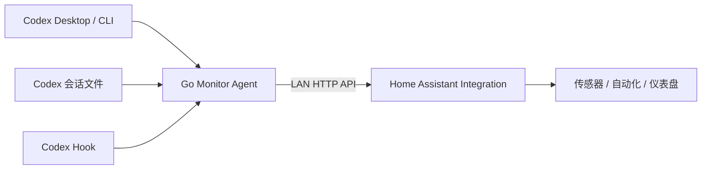

# Codex HA Monitor

[](https://github.com/zhangchaosd/codex-ha-monitor/actions/workflows/ci.yml)
[](https://github.com/zhangchaosd/codex-ha-monitor/actions/workflows/release-agent.yml)

在局域网中把 Codex Desktop/CLI 的运行状态接入 Home Assistant。

本仓库包含两个组件：

- `agent/`：运行在 Codex 电脑上的 Go 只读监控代理。
- `custom_components/codex_monitor/`：Home Assistant 自定义集成。

当前版本只读取状态，不提供批准或控制操作。按照项目约定，不设计身份认证：局域网中任何能够访问代理 URL 的设备都可以读取代理暴露的信息。

## 功能

- 展示 Codex 是否运行、空闲、等待批准、等待输入或发生错误。
- 展示当前任务、活动任务数和连接状态。
- 展示 Codex CLI 版本、代理版本、Token 用量和限额重置时间。
- 同时支持 Hook、Codex app-server 和会话文件系统数据源。
- Home Assistant UI 配置、多主机、中文/英文翻译和诊断下载。
- GitHub Actions 自动测试并发布 macOS、Linux 和 Windows 代理二进制。

## 架构



## 1. 安装代理

从 [Releases](https://github.com/zhangchaosd/codex-ha-monitor/releases) 下载对应平台的压缩包，解压后运行：

```bash
chmod +x codex-monitor-agent
./codex-monitor-agent --bind 0.0.0.0 --port 8765
```

也可以从源码构建：

```bash
cd agent
go build -o ./bin/codex-monitor-agent ./cmd/cma
./bin/codex-monitor-agent --bind 0.0.0.0 --port 8765
```

验证接口：

```bash
curl http://127.0.0.1:8765/healthz
curl http://127.0.0.1:8765/api/v1/version
curl http://127.0.0.1:8765/api/v1/status
```

代理默认监听 `0.0.0.0:8765`。Hook 配置、状态来源优先级和更多参数见 [`agent/README.md`](agent/README.md)。

## 2. 安装 Home Assistant 集成

### HACS

1. 在 HACS 中添加自定义存储库：`https://github.com/zhangchaosd/codex-ha-monitor`。
2. 类别选择“集成”。
3. 安装 **Codex Monitor** 并重启 Home Assistant。

### 手动安装

把 [`custom_components/codex_monitor`](custom_components/codex_monitor) 复制到 Home Assistant 的 `/config/custom_components/`，然后重启 Home Assistant。

## 3. 配置 Home Assistant

1. 打开“设置 → 设备与服务 → 添加集成”。
2. 搜索 **Codex Monitor** 或 **Codex 监控**。
3. 输入代理的局域网 URL，例如 `http://192.168.1.20:8765`。

每套代理安装根据稳定的 `installation_id` 创建一个设备。默认每 5 秒更新，可在集成选项中调整到 5–300 秒。

`127.0.0.1` 只有在 Home Assistant 和代理处于同一网络命名空间时才有效；Home Assistant OS、Docker 或独立主机通常需要填写 Codex 电脑的局域网 IP。

## Home Assistant 实体

默认实体包括：

- 工作状态、当前任务、活动任务数
- Codex 连接状态和连接二元传感器
- Codex/代理版本
- 累计 Token、限额已用比例和重置时间
- 运行中、需要处理二元传感器

已知任务数、连续使用天数、次级限额、Hook 计数和数据过期状态默认禁用，可在设备页面手动启用。完整任务 JSON 只出现在诊断下载中，避免 Home Assistant Recorder 频繁保存大块属性。

HA 集成的详细设计见 [`docs/ha-integration-architecture.md`](docs/ha-integration-architecture.md)，代理规格见 [`docs/agent-spec-v1.2.zh-CN.md`](docs/agent-spec-v1.2.zh-CN.md)。

## 开发

代理：

```bash
cd agent
go test ./...
go vet ./...
go build ./cmd/cma
```

HA 集成：

```bash
uv run --python 3.13 --with aiohttp --with pytest --with pytest-asyncio pytest -q
uvx ruff check .
uvx ruff format --check .
```

## 发布代理二进制

`.github/workflows/release-agent.yml` 使用 GitHub CLI 创建 Release。推送 `agent-v*` 标签会自动交叉编译并上传所有平台制品；也可以手动运行工作流并输入标签：

```bash
gh workflow run release-agent.yml -f tag=agent-v0.2.0
```

工作流会验证标签版本与代理源码版本一致，生成压缩包、`SHA256SUMS.txt`，并通过 `gh release create` 或 `gh release upload` 发布。

## License

[MIT](LICENSE)
