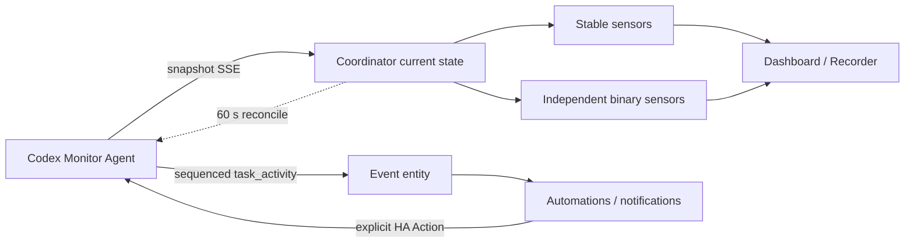

# Home Assistant 集成架构与验收设计

> 对应 `codex_monitor` 0.2.x、Agent 0.4.x、协议 Schema 1.1。

## 设计结论

从 AI Agent 使用者看，Codex 不是一台只有“忙/闲”开关的设备，而是一组会动态增减的工作流和 worker；从 Home Assistant 的设计初衷看，实体应表达稳定事实，离散变化应通过事件触发自动化，诊断细节不应持续污染 Recorder。因此本集成采用：

- 每台安装 Agent 的电脑对应一个 HA 设备，而不是每个临时 Codex 会话对应一个设备。
- 少量稳定聚合实体负责仪表盘；完整会话层级保留在“当前任务”属性、事件和诊断中。
- `event.task_activity` 表达开始、完成、失败、等待处理等离散变化。
- SSE 本地推送负责实时性，60 秒轮询只做首次加载和断线校准。
- “运行”“需要用户处理”“失败”分别建模，避免一个聚合枚举遮蔽并发事实。
- 控制操作使用 HA Action，并要求设备、request/thread/turn 精确匹配。



## AI Agent 使用语义

### 工作流与 worker

一个用户发起的根线程是一个 workflow；根线程和它的每个活动子代理都是 worker。

- `active_workflows`：有运行/等待批准/等待输入 worker 的不同根线程数。
- `active_workers`：处于上述活动状态的线程总数。
- `parent_thread_id` / `root_thread_id` / `thread_role`：用于解释子代理归属。

这能正确表达“1 个用户任务正在由 3 个 Agent 并行处理”，而不是向用户显示 3 个彼此无关的任务。

### 独立事实而非单值覆盖

当 worker A 在运行、worker B 等待批准、worker C 失败时：

- `binary_sensor.running = on`
- `binary_sensor.attention_required = on`
- `binary_sensor.task_problem = on`
- 聚合 `sensor.workload_state = waiting_approval`，仅作为最需要关注的标题状态。

聚合优先级为批准、输入、失败、运行、空闲、未知。自动化应优先使用独立二元传感器或任务事件，不能只判断聚合状态。

### 精度与可控性

每个线程携带 `state_source`、`state_confidence` 和 `controllable`。Hook/App Server 请求可提供事件级或精确状态；文件时间只能推断活动。没有共享全局 App Server 时，“没有看到活动”不等于整台电脑已经空闲。

Agent 自己启动的 App Server 与 Codex Desktop 的 App Server 通常是不同进程。Desktop 会话可以从文件系统识别到细粒度的多个线程，但其批准通道不能由 Agent 接管。只有收到 Agent 自有 App Server 请求且 `controllable=true` 时，HA Action 才可执行。

## 配置与发现

配置条目保存：

```json
{
  "url": "http://192.168.1.20:8765",
  "token": "configured bearer token",
  "name": "optional initial display name"
}
```

Agent 通过 `_codex-monitor._tcp.local.` 发布 Zeroconf。发现记录使用稳定 `installation_id` 去重并自动更新已有条目的 URL，但不会传递 Token。用户确认发现设备时仍需输入凭证。

手动配置与重新配置会并发请求 `/api/v1/version` 和 `/api/v1/status`，要求：

- 两个响应的 `installation_id` 相同且非空。
- Schema 主版本为 1。
- 重新配置后的安装 ID 与原条目一致。

运行时收到 401/403 会触发 HA reauth flow；更新 Token 后重载同一配置条目，保留设备和实体 ID。协议不兼容会创建 HA Repairs issue，成功恢复后自动清除。

## 更新与恢复模型

初始加载并发读取 `/status` 与 `/threads?limit=50`，随后只为配置条目建立一条共享 SSE：

- `snapshot`：包含完整线程列表，替换协调器当前状态。
- `task_activity`：交给事件实体，保留事件 ID 供重连。
- 15 秒注释心跳：避免中间设备把空闲连接关闭。
- 45 秒没有任何字节：客户端认为连接断开。
- 重连退避：1、2、4……最长 30 秒；携带 `Last-Event-ID`。
- 如果收到不连续事件 ID，先从最后已交付 ID 强制重连重放；若缺口已经超出 Agent 的 256 条窗口，则校准完整快照并从最早仍保留的事件继续，避免静默遗漏或无限重连。

协调器每 60 秒执行一次 REST 校准，可在选项中设置 5–300 秒。SSE 失效时会立即请求一次校准，实体仍使用上一个有效快照，HA 可见不可用/陈旧状态而不是把数据清零。

Agent 在内存中保留最近 256 条任务事件。正常短时断网可从 ID 后重放；Agent 重启会重置序号，此时完整快照恢复当前事实，但已经发生且超出内存/进程生命周期的历史事件不能凭空重建。

## 实体模型

### 默认启用

| 平台 | 实体 | 用途 |
|---|---|---|
| sensor | Workload state | 注意力优先的聚合枚举。 |
| sensor | Current task | 最值得关注的线程名称；属性含精确控制和层级 ID。 |
| sensor | Active workflows | 活动根工作流数。 |
| sensor | Connection state | App Server 连接/恢复状态。 |
| sensor | Codex version / Agent version | 部署诊断。 |
| sensor | Primary rate limit used/reset | 容量规划。 |
| binary_sensor | Running | 是否存在任意运行 worker。 |
| binary_sensor | Attention required | 是否存在批准或输入请求。 |
| binary_sensor | Task problem | 是否存在失败线程。 |
| binary_sensor | Connected | Agent 的 Codex App Server 是否已连接。 |
| event | Task activity | 自动化使用的离散任务事件。 |

### 默认关闭的诊断/高级实体

活动 worker、运行/批准/输入/失败计数、已知任务数、终身 Token、连续使用天数、次限额、Hook 计数和陈旧数据。这样默认设备页面保持克制，需要高级仪表盘时仍可逐项启用。

本集成不会为每个 thread 动态创建/删除实体。临时 thread 实体会导致 Entity Registry 膨胀、历史残留和难以维护的自动化；完整列表通过 Agent API 和诊断下载获取。

## Recorder 与属性控制

`MonitorSnapshot` 的相等指纹排除纯时间噪声：

- `generated_at`
- Agent uptime
- 仅由文件系统触碰产生、但没有语义状态变化的更新时间

Agent 还会在发送 SSE 前排除 `generated_at`、uptime、单纯更新时间和每日用量桶的影响，语义没有变化就不重复广播；每日历史只通过 `/usage` 按需读取。因此即使执行周期校准，`always_update=False` 也不会让所有实体反复写 Recorder。当前任务、工作状态等实体的动态诊断属性声明为 `_unrecorded_attributes`，Home Assistant 不会把 cwd、完整层级、请求 ID 等每次变化都写入长期数据库。完整原始线程只进入 diagnostics。

## 任务事件

`event.task_activity` 支持：

- `task_started`
- `task_completed`
- `approval_required`
- `input_required`
- `task_failed`
- `task_interrupted`
- `task_resumed`
- `agent_recovered`

事件数据包括已知的 `thread_id`、`turn_id`、父/根线程、Agent 昵称、状态变化、来源/置信度、`request_id`、`controllable` 和发生时间。事件不会自动执行控制，是通知和自动化的触发入口。

## HA Actions

集成注册：

- `codex_monitor.approve_request`
- `codex_monitor.reject_request`
- `codex_monitor.submit_input`
- `codex_monitor.interrupt_turn`

所有 Action 首先用 `device_id` 找到唯一 Agent。请求类操作要求 `request_id + thread_id + turn_id`；中断要求 `thread_id + turn_id`。单问题输入可传 `text`，多问题输入传 `answers`（问题 ID 到字符串数组）。错误会转成 HA `ServiceValidationError`，不会假装成功。

批准或拒绝默认只解析当前请求；`for_session` 请求 Codex 接受同会话匹配操作，`cancel_turn` 使用 Codex 的 cancel 决策。自动化作者仍应把远程批准视为高影响行为，仅对明确匹配的工具/目录/上下文配置规则。

## 故障和降级验收

| 故障 | 预期行为 |
|---|---|
| Agent 离线 | SSE 退避重连，REST 校准失败，保留最后快照并显示不可用。 |
| Token 失效 | 触发 reauth，不无限重试旧凭证。 |
| Schema 不兼容 | 更新失败并创建 Repairs issue；升级后清除。 |
| App Server 失败 | Agent 回退到文件系统，重复账户读取失败时重启自有子进程。 |
| Desktop 请求不可控 | `controllable=false`；Action 返回冲突而不猜测。 |
| 请求已经处理 | Agent 返回 404；HA Action 明确失败。 |
| SSE 短时断线 | 使用 Last-Event-ID 重放保留事件，再应用当前快照。 |
| 空闲且内容未变化 | 快照相等，实体不产生无意义 Recorder 更新。 |

## 自动化建议

优先用 `event.task_activity` 的 `approval_required`/`input_required` 发通知，并在通知中展示任务名和设备；对“所有工作完成”可用 `active_workflows` 从非零变为零并配合去抖。不要把 `connected=off` 当作任务失败，也不要把 `UNKNOWN` 当作空闲。

仓库提供的 [通知蓝图](../blueprints/automation/codex_monitor_attention.yaml) 只负责通知，不会自动批准请求。
