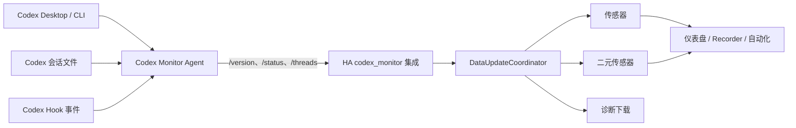

# Home Assistant 集成设计

## 目标与边界

`codex_monitor` 是 Codex Monitor Agent 的只读 Home Assistant 客户端。第一版负责发现不了、但能由用户显式配置的局域网 HTTP 代理，并把稳定、可自动化的状态映射为 HA 设备和实体。

本版本不实现批准、输入、启动任务或停止任务；也不实现鉴权、TLS 管理、来源限制和数据脱敏。局域网中任何能访问代理 URL 的设备都可以读取代理暴露的信息。

## 组件关系



## 配置模型

每个配置条目保存：

```json
{
  "url": "http://192.168.1.20:8765",
  "name": "可选的首次显示名称"
}
```

选项只保存 `scan_interval`，范围 5–300 秒，默认 5 秒。设备与所有实体的唯一 ID 以代理返回的 `installation_id` 为前缀，因此 URL 改变不会新建设备。

配置时并发请求 `/api/v1/version` 与 `/api/v1/status`。两者的 `installation_id` 必须一致。重新配置 URL 时，新代理 ID 必须与原配置条目的唯一 ID 一致。

## 更新模型

协调器并发读取 `/api/v1/status` 和 `/api/v1/threads?limit=50`，组合为不可变的 `MonitorSnapshot`。原始响应保留给实体属性和诊断使用，但快照相等性只比较实体实际消费的数据。

以下字段不会单独触发实体更新：

- `generated_at`
- `agent.uptime_seconds`
- 任务的文件系统 `updated_at`

这样可避免空闲时每 5 秒写一次 Recorder。状态、任务身份、Hook、用量、限额、版本或连接信息发生变化时，指纹才改变。

## 任务选择规则

“当前任务”从非空闲任务中选择，优先级依次为：

1. `waiting_approval`
2. `waiting_input`
3. `running`
4. `error`

同一优先级选择 `updated_at` 最新的任务。传感器状态最多 255 个字符，优先使用 `name`，然后使用 `preview`，最后使用线程 ID。

## 故障行为

- 配置阶段网络失败：表单显示“无法连接”，不创建条目。
- JSON 或协议结构不兼容：表单显示“响应不受支持”。
- 正常运行后代理离线：协调器更新失败，现有实体标记为不可用；恢复后自动重新更新。
- 用量或限额不可用：只影响相应实体值，不影响设备其余状态。
- 任务数组含有无效项目：忽略无效项目；若 `threads` 根字段不是数组，则拒绝整次更新。

## 后续控制能力的扩展点

未来可为同一配置条目增加 `button`、`event` 或集成服务，并由 API 客户端调用代理新增的控制接口。控制能力应沿用当前 `installation_id`、协调器和设备注册信息，不需要迁移现有只读实体。若采用 app-server 的实时批准事件，可把协调器升级为 SSE 推送加低频轮询兜底，清单的 IoT 类型相应改为 `local_push`。
